# Introdução

Nesse documento irei descrever as análises obtidas por mim para a base de dados e problemas levantados. Alguns gráficos
das análises foram mantidos nos arquivos .html, por possuir informações extras ao interagir com os gráficos, ou por
serem muito grandes para colocar nesse arquivo.

# Analisando Conversão

Em minhas análises, busquei primeiro entender como estava a relação de visitas e conversão tanto para departamentos,
como para os prefixos de CEP, a fim de tentar entender a relação entre regionalidade e departamento do produto com a
conversão de uma visita.

Primeiramente gostaria de discutir a análise da conversão de uma visita a partir dos departamentos existentes na base de dados fornecidas.
Para isso, criei o job `codigo/jobs/graphics/job_analise_conversao_departamento.py` para ler uma base de dados particionada primeiramente
por departamento (gerado pelo job `codigo/jobs/pedidos/job.py`) e gerar uma grade de gráficos com as conversões para cada departamento.
Nesse [arquivo](analise/analise_conversao_por_departamento.html) é mostrado a quantidade de visitas convertidas e não
convertidas para cada departamento, ordenados pela quantidade total de visitas. No arquivo é possível verificar
uma grade de gráficos para cada departamento, sendo que o primeiro departamento, com maior quantidade de visitas
é o *cama_mesa_banho*. Em minhas análises futuras irei focar apenas nas visitas relacionadas a este departamento, para toda o
período de tempo existente na base de dados (01/06/2020 - 31/06/2020). Outro fato interessante é a taxa de conversão
(representado pelo TC no título dos gráficos) entre diversos departamentos são muitos próximos, sendo também o valor
obtido pelos clusters entre os algoritmos, como veremos mais a frente.

Na segunda análise de relação com a conversão, das visitas feitas ao departamento *cama_mesa_banho*, extraí as conversões
baseadas no prefixo do CEP da visita. O job `codigo/jobs/graphics/job_analise_conversao_cep.py` executa essa tarefa, gerando
um gráfico de barras verticais, coloridos pelos valores de conversãoo e não conversão.
O resultado pode ser visto no [arquivo](analise/analise_conversao_por_cep.html),
com os 10 CEPs com maior quantidade de visitas. Essa análise foi um passo importante para tentar entender se o prefixo do
CEP possui alguma informação interessante para a conversão de uma visita, e analisando o gráfico, é possível ver que a
taxa de conversão diferencia dependendo do CEP de origem da visita, para o departamento *cama_mesa_banho*. Por exemplo,
o CEP 24220 possui uma taxa de conversão de 0.145 enquanto  o CEP 38400 é de 0.163.

# Escala dos Dados

Um tópico de importância antes de iniciar a discussão sobre a escala dos valores das variáveis, é quais variáveis foram
escolhidas por mim e porque. No código inicial, as variáveis escolhidas eram *preço*, *prazo*, *frete*, *latitude* e *longitude*.
Decidi por manter os três primeiros, visto que é de conhecimento geral que são variáveis importantes para a compra de um produto,
porém decidi remover a *latitude* e *longitude*, e adicionar o *cep_prefixo*. O raciocínio por trás de minha decisão foi que,
dado que a *latitude* e *longitude* estavam atrelados à um CEP completo da visita, apenas o prefixo possui a informação
dada pela *latitude* e *longitude*, com um adicional de informação de regionalidade para as visitas, o que é um fator para
a compra de produtos.

Agora gostaria de discutir os resultados obtidos para os métodos de escala de dados listados. O job `codigo/jobs/escala_pedidos/job_scale.py`
ficou responsável de fazer a escala dos dados baseado em um método passado como parâmetro. Como pedido, após rodar os métodos
no dataset de todas as visitas do departamento *cama_mesa_banho*, gerei uma série de gráficos para analisar a diferença dos valores
antes e depois da execução. Nessa série de gráficos, foi feito um histograma para a contagem de valores para cada uma das features
escolhidas, assim como um gráfico scatter da relação de valores entre cada uma das features. Essa análise foi feita para as
duas primeiras semanas da base de dados (01/06/2020 - 08/06/2020 e 08/06/2020 - 16/06/2020).

Analisando os gráficos obtidos para cada uma das semanas, que estão neste [diretório](analise/analise_escala/), decidi levar
os valores dos métodos **MinMax**, **Robust** e **Standard**, por manterem a distribuição dos valores para cada variável identicas
a distribuição antes da execução da escala. Outro método que manteve a mesma distribuição foi o **MaxAbs**, porém visto que
o range dos valores variam de [0, 1] assim como no **MinMax**, resolvi escolher apenas um dos dois, e usar **Robust** que varia entre [-1, 1]
e **Standard** que varia entre [-1.5, 1.5], e com isso manter uma maior diversidade de valores.

# Clustering

Para o clustering dos dados, minha primeira decisão foi parecida com a que me fez escolher sobre os métodos de escala,
tentar manter o máximo de diversidade no método de construção dos clusters. Meus métodos escolhidos foram: **AgglomerativeHierarchical**,
**SpectralClustering**, **AffinityPropagation** e **OPTICS**. **KMeans** é uma técnica baseada em centroid, então em outras técnicas
tentei me afastar dessa abordagem, por exemplo **AgglomerativeHierarchical** e **OPTICS** que usam uma metodologia horientada a aglomerações
de instâncias no espaço. Porém obtive problemas na execução das quatro técnicas escolhidas, assim como para a o **DBSCAN**.
**SpectralClustering**, **AffinityPropagation**, **AgglomerativeHierarchical** e **DBSCAN** necessitavam de uma maior quantidade
de memória para executar um clustering dado o número de instâncias, e **OPTICS** não conseguiu rodar em tempo hábil.

No fim, executei o clustering com os métodos: **KMeans**, **Birch** (outra abordagem baseada em centroid) e **GaussianMixtures**, todos com 4 clusters como parâmetro.
A decisão da quantidade de clusters usadas foi interamente aleatória, sei da existência de métodos estatísticos para encontrar um
número de clusters ótimo porém não o apliquei pelo fator tempo.

Para visualizar os resultados da distribuição das instâncias nos clusters, busquei criar uma função (`jobs/graphics/job_analise_clustered_components_pca.py`)
para reduzir a dimensionalidade das minhas features para duas dimensões, usando o **Princial Component Analysis** (PCA),
e dessa forma gerar um gráfico mais legível dessa distribuição das instâncias, baseadas no cluster atribuído as mesmas.
Esses gráficos estão nesse [diretório](analise/analise_cluster/), e estão nomeados baseados no dataset e no método de clustering
, como exemplo temos o arquivo `birch_instancias_minmax`.

## MinMax
| KMeans | Birch | GaussianMixtures |
| ----- | ----- | ----- |
| 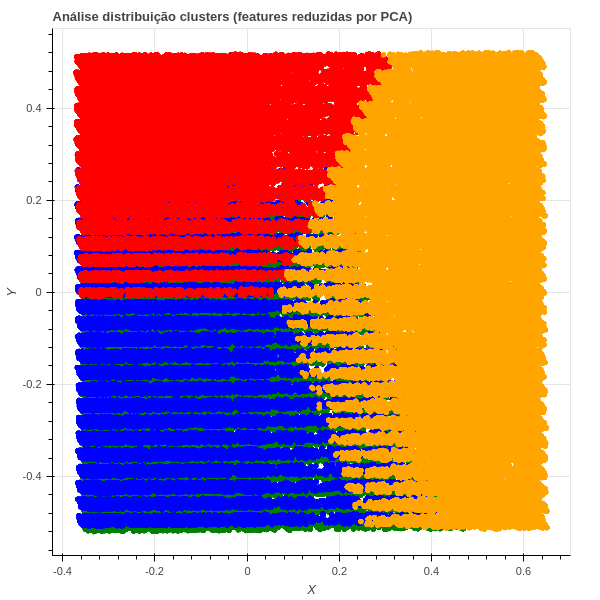  | 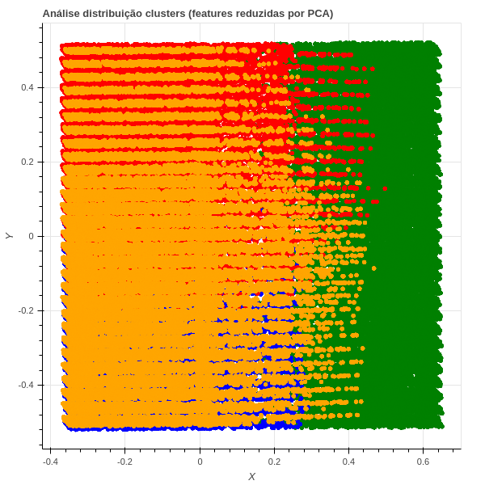  | 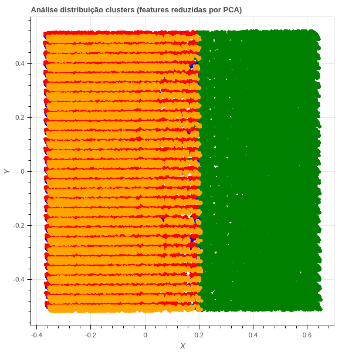  |

Iniciando pela distribuição gerada com os dados escalados por **MinMax**, pode-se verificar nas imagens que os métodos de clustering
conseguiram encontrar agrupamentos de pontos próximos, porém por conta da redução de dimensionalidade, existe uma certa sobreposição
de alguns clusters com outros, mas é possível determinar e delimitar as regiões de cada cluster. Essa sobreposição pode indicar
uma proximidade desses clusters no espaço não reduzido dos dados.

Um comportamento interessante ao olhar para os gráficos gerados por cada um dos modelos é que os pontos mais a direita do gráfico
sofreram pouca ou nenhuma sobbreposição com outros clusteres, o que talvez indique uma facilidade de indicar um comportamento parecido
para essas instâncias.

Olhando os gráficos de conversão para cada clusters, [KMeans](analise/analise_cluster/kmeans_conversao_minmax.html),
[Birch](analise/analise_cluster/birch_conversao_minmax.html), [GaussianMixtures](analise/analise_cluster/gaussian_conversao_minmax.html)
(no mesmo diretório dos gráficos analisados anteriormente), cada método de clustering
obteve uma distribuição de quantidade de pontos entre clusters única, porém todos com valores de taxa de conversão muito próximas, compatíveis
com a conversão do departamento analisado.

## Standard

| KMeans | Birch | GaussianMixtures |
| ----- | ----- | ----- |
| 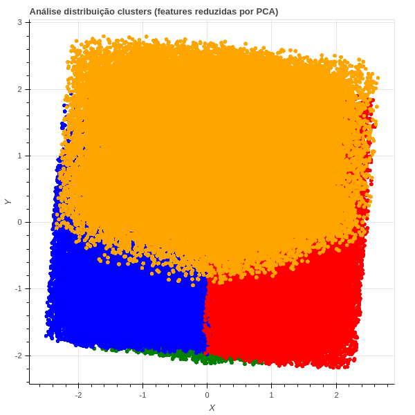  | 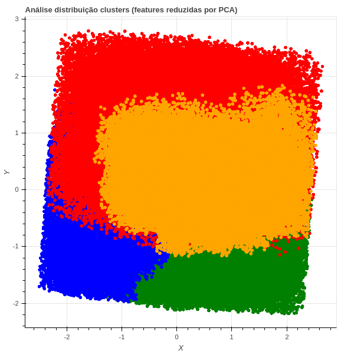  | 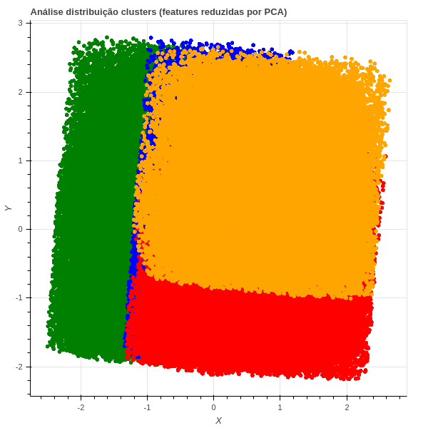  |

Para estes dados, o **Birch** possui uma distribuição de dados entre clusters parecido com o que foi obtido com o **MinMax** usando o
mesmo algoritmo. Porém ao observar seu resultado no gráfico do PCA temos um comportamento de distribuição dos clusters totalmente diferente,
onde para o **MinMax** houve a sobreposição de três clusters, aqui os pontos estão com uma distinção maior de suas fronteiras, com poucas sobreposição
entre três clusters, mas uma sobreposição de um clusters inteiro em outro, indicando uma proximidade.

Com o **GaussianMixtures**, o comportamento foi parecido para o gráfico do PCA, porém esse método obteve uma distribuição mais homogênea do número
de instâncias em cada cluster. Já para o **KMeans**, a distribuição e o gráfico do PCA são quase identicos com relação a proximidade entre cluster,
 aos obtidos pelo mesmo método nos dados **MinMax**.
Assim como no **MinMax** a taxa de conversão das visitas são muito próximas para todos os clusters em todos os algoritmos. As taxas de conversão para
cada cluster pode ser vista nos arquivos [KMeans](analise/analise_cluster/kmeans_conversao_standard.html),
[Birch](analise/analise_cluster/birch_conversao_standard.html), [GaussianMixtures](analise/analise_cluster/gaussian_conversao_standard.html).

## Robust

| KMeans | Birch | GaussianMixtures |
| ----- | ----- | ----- |
| 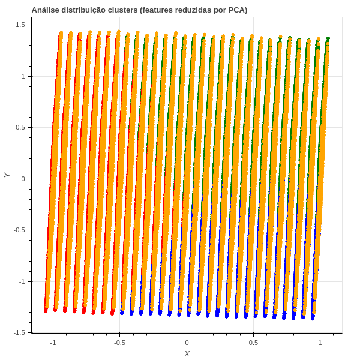  | 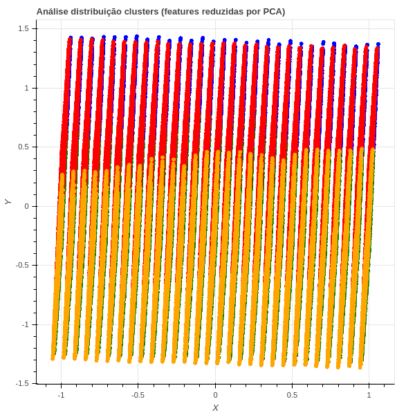  | 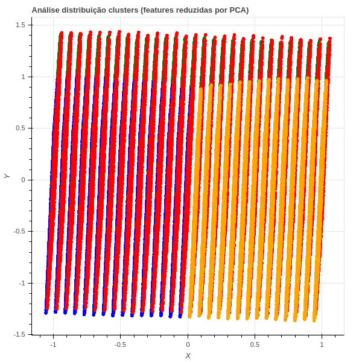  |

Os dados escalados pelo o robust obtiveram resultados diferentes dos obtidos pelos dois últimos datasets. Primeiramente em seu gráfico gerado pelo espaço
do PCA temos regiões lineares de agrupamentos de instâncias, no qual os clusters tiveram um grau de sobreposição nesse espaço em todos os algoritmos de
clustering testados.

Para o **Birch** houve uma tendência a ele atribuir uma grande quantidade de instâncias a apenas um cluster, enquanto **GaussianMixtures** e **KMeans** conseguiram
manter um equilíbrio nessa distribuição. A taxa de conversão também manteve-se próximas para todos os clusters gerados por todas as técnicas, e
mantiveram um valor compatível a taxa de conversão do departamento analisado. As taxas de conversão
para cada cluster estão nos arquivos [KMeans](analise/analise_cluster/kmeans_conversao_robust.html),
[Birch](analise/analise_cluster/birch_conversao_robust.html), [GaussianMixtures](analise/analise_cluster/gaussian_conversao_robust.html).

# Conversão Diária dos Clusters

| Dataset | KMeans | Birch | GaussianMixtures |
| ------- | ----- | ----- | ----- |
| MinMax | 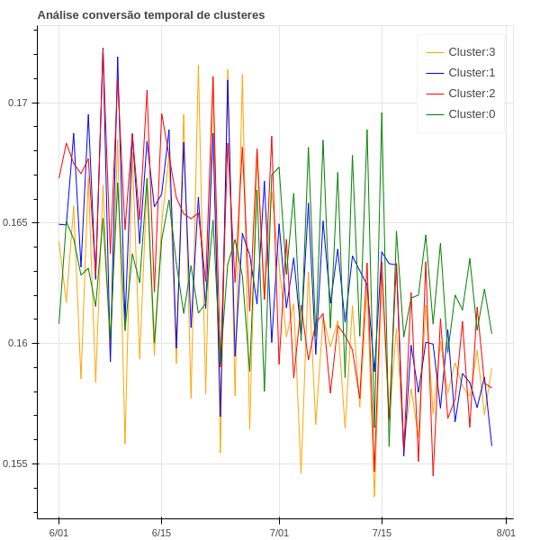  | 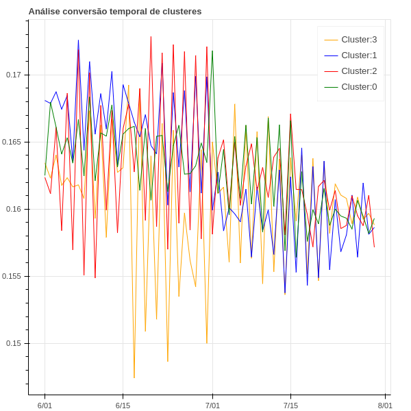  | 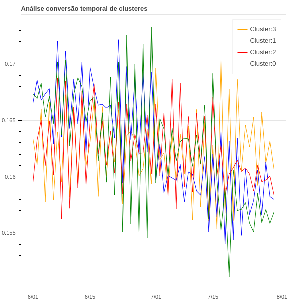  |
| Standard | 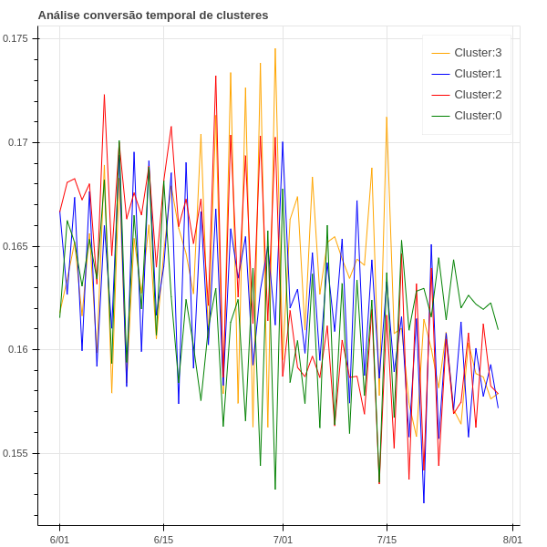  | 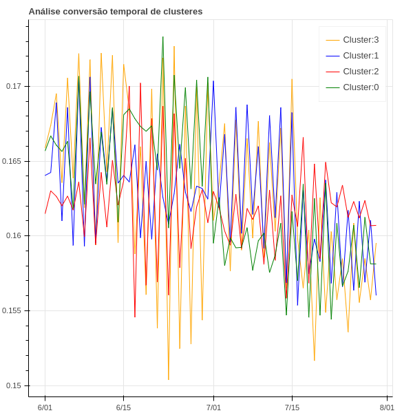  | 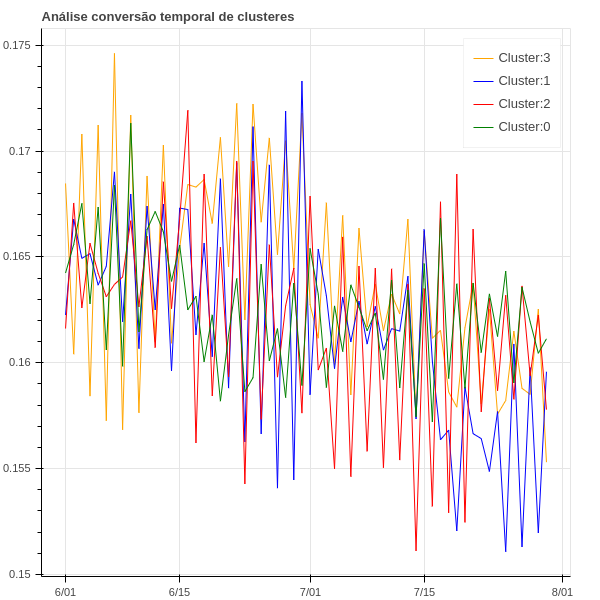  |
| Robust | 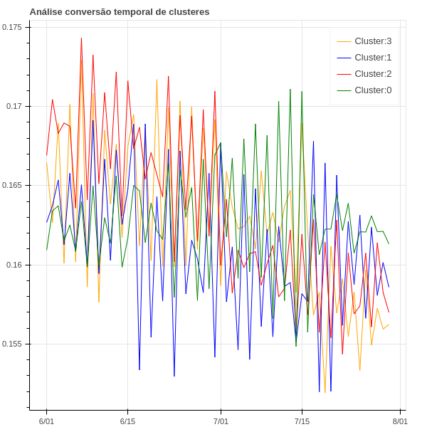  | 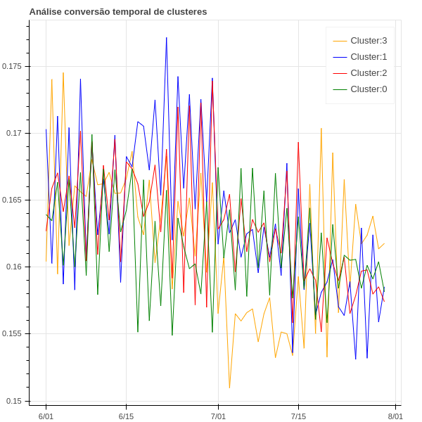  | 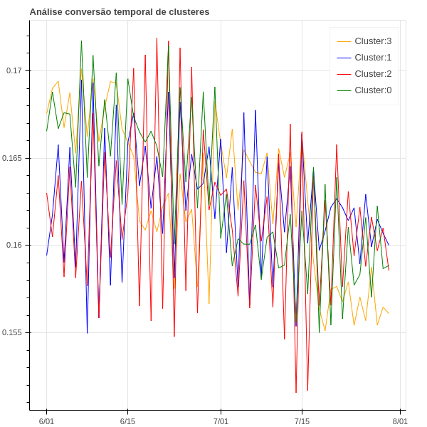  |

Para essa análise, usei o job `jobs/particiona_dados/particiona_conversao/job.py` para minerar a quantidade de visitas convertidas e não convertidas
para cada cluster de acordo com algum agrupamento fornecido pelo usuário (data, hora, minuto). Obtendo o cálculo do valor, servi-o como entrada
para o job `jobs/graphics/job_plot_conversao_particionada.py` para gerar o gráfico temporal da taxa de conversão, que podem ser encontrados em
`analise/taxa_conversao_dia/`.

Para cada um dos gráficos, é possível ver que todos os métodos de clustering obtiveram um valor próximo de conversão, entre os valores 0.15 e 0.175.
Como não possuo conhecimento aprofundado na área para fazer uma análise, não consigo dissertar se são bons valores ou quais
clusters deveriam sofrer alguma intervenção, pois uma variação de 0.025 de valores me parecem muito próximos. O que diria que pode ser
um bom foco de intervenção são os clusters que possuam um número de visitas absolutas maiores, o que pode gerar um aumento de conversão.
Um comportamento que achei interessante é o fato da taxa de conversão estar caindo para diversos clusters nos últimos dias de dados do dataset,
o que pode mostrar uma falha nas vendas, ou talvez algum fenômeno externo que esteja resultando em uma menor quantidade de compras para esses agrupamentos, o
que vale uma análise futura mais detalhada sobre esse fenômeno.

# Considerações Finais

Gostaria de concluir minha análise dizendo que essa análise foi feita e gerada apenas para um departamento por conta da limitação de memória
pelo tamanho da base de dados. Como pipeline para essa minha análise, gerei dois scripts, o primeiro (`pipeline1.sh`) responsável por executar o
processamento inicial nos dados e gerar as análises de conversão por departamento. O segundo (`pipeline2.sh`) realiza a pipeline das análises e processamentos
subsequentes sobre os dados de um departamento passado como parâmetro, exceto as análises dos dados escalados.

